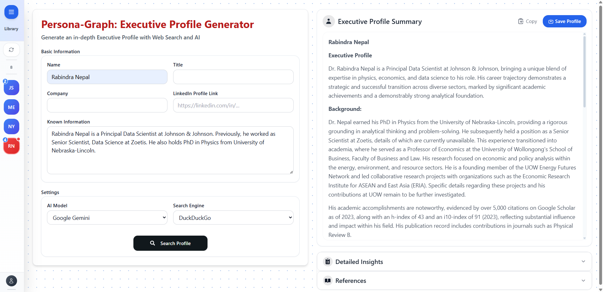

## PersonaGraph: Executive Profile Generator

PersonaGraph is a generative AI-powered platform for in-depth enrichment of executive and senior professional profiles. It leverages advanced web scraping, multi-agent orchestration, and large language models (LLMs) to deliver comprehensive, up-to-date leadership intelligence.

### What Does It Do?
PersonaGraph automates the process of gathering, synthesizing, and enriching executive profiles using public web data and AI. By inputting basic information (name, title, company, LinkedIn, etc.), users receive a detailed, AI-generated profile summary, leadership insights, and referenced background information—enabling faster, deeper, and more reliable executive research.

### Potential Use Cases
- **Recruiting for Senior Leadership:** Companies and executive search firms can proactively identify, vet, and compare candidates for C-level and other strategic roles.
- **Succession Planning:** Organizations can continuously monitor and plan for key leadership transitions, identifying potential internal and external successors.
- **Venture Capital & Private Equity:** VC/PE firms can rapidly assess leadership teams of target companies or startups for due diligence, investment, or partnership decisions.
- **Competitive & Market Intelligence:** Analysts can benchmark leadership teams across industries, track executive moves, and map talent networks.

## How the Agentic Solution Works
PersonaGraph uses an agentic backend built on LangGraph, where each major aspect of profile enrichment is handled by specialized agents (subgraphs). The system orchestrates these agents in a directed graph:
- **Background Agent:** Gathers and synthesizes professional history and education.
- **Leadership Agent:** Extracts and analyzes leadership style, experience, and impact.
- **Strategy Agent:** Surfaces strategic initiatives, vision, and business approach.
- **Reputation Agent:** Assesses public reputation, media presence, and sentiment.
- **Profile Aggregator:** Combines all agent outputs into a unified, referenced executive profile.

Agents use web search tools combined with advanced custom web scrapers and LLM-powered analysis to extract, rank, and process web data. The LangGraph setup enables modular, parallel, and extensible enrichment pipelines.

## Key Features
- **Real-time Streaming:** Watch as each agent completes its analysis with live progress updates
- **Profile Library:** Save, version, and manage executive profiles with a sleek sidebar interface
- **Intelligent Caching:** Avoid duplicate processing with smart result caching
- **Graceful Error Handling:** Partial results delivered even when some components fail
- **Production-Ready:** Built for scalability with robust WebSocket streaming and database persistence

## UI
The frontend is a polished React.js app (ShadCN UI, Tailwind CSS, Framer Motion) featuring:
- **Streaming Interface:** Real-time progress tracking with animated components
- **Profile Management:** Intuitive collapsible sidebar for accessing saved profiles and versions
- **Responsive Design:** Smooth animations and adaptive layouts for optimal user experience
- **WebSocket Integration:** Live updates with intermediate progress streaming during the enrichment process

### Example Output
Below is a snapshot of the UI showing the final generated profile [dynamic layout with animations during streaming]:



## Getting Started
---
### 1. Backend (Python)
- Install dependencies: `pip install -r requirements.txt`
- Run the backend:
  ```
  cd backend
  python app.py
  ```

### 2. Frontend (React)
- Install dependencies: `npm install`
- Start the dev server:
  ```
  cd ui
  npm start
  ```
- Access the app at [http://localhost:3000](http://localhost:3000)

### Development Notes
- **Streaming Architecture:** WebSocket-based real-time communication between frontend and backend
- **Agentic Graph:** LangGraph orchestrates specialized agents for different aspects of profile enrichment
- **Database:** SQLite with automatic versioning for profile management
- **Error Resilience:** Graceful degradation ensures partial results even with component failures

## License
MIT

